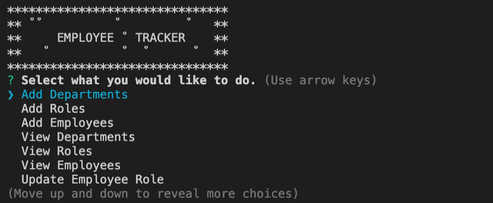

# Employee Tracker

This program creates a CMS interface (content management system). I built a solution for managing a company's employees using node, inquirer, and MySQL.

I built a command-line application that allows the user to:

  * Add departments, roles, employees

  * View departments, roles, employees

  * Update employee roles

```
As a business owner I would want to be able to view and manage the departments, roles, and employees in my company so that I can organize and plan my business.
```

## Installation Instructions

```
npm init, npm i, npm i inquirer, npm i mysql, npm i env, npm i dotenv
```

## Command line Screenshot

